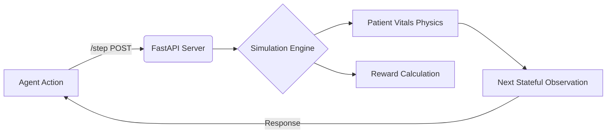

<div align="center">
  <h1>🏥 ClinicalTriageEnv</h1>
  <p><b>From lab bench to emergency triage — an AI agent's journey through Indian diagnostics</b></p>
  
  <p>
    <a href="https://github.com/openenv-ai/openenv"></a>
    
    
    
  </p>
</div>

An [OpenEnv competition environment](https://openenv.ai) simulating a bustling diagnostic center in a Tier-2 Indian city. Imagine managing 200+ lab reports a day with limited clinical staff, where equipment can be faulty, formats inconsistent, and the boundary between normal and critical requires strong deductive reasoning. The AI agent progressively takes on higher stakes responsibilities across three carefully tuned tasks of increasing difficulty.

---

## 🧐 Motivation & Problem Statement

India's diagnostic lab ecosystem processes millions of reports daily. In Tier-2 and Tier-3 cities, a single doctor often reviews hundreds of reports packed with "messy" real-world issues:

- ❌ **Missing values:** Machines fail, samples get lost, or results show `--` or `N/A`.
- 🧪 **Unit inconsistencies:** `mg/dL` vs `mg/dl` vs `MG/DL` interchangeably.
- 🔀 **Name variations:** `SGPT`, `ALT`, `S.G.P.T`, `Alanine Aminotransferase` all represent the same test.
- 🩺 **Borderline edge-cases:** Is a Fasting Sugar of `100 mg/dL` considered perfectly normal or dangerously pre-diabetic?

Unlike standard textbook LLM benchmarks, ClinicalTriageEnv trains AI agents to handle **dynamic, chaotic, and messy medical data in real-time.** 

---

## 🎯 Task Breakdown

The environment is structured in an escalating learning curve reflecting clinical responsibility.

### 🥉 Task 1: Lab Technician (Easy)
The agent examines a single patient's lab report and must correctly categorize and flag each test value.
* **Goal:** Detect all critical and missing values.
* **Status Categories:** `NORMAL`, `LOW`, `HIGH`, `CRITICAL_LOW`, `CRITICAL_HIGH`, `MISSING`.
* **Reward Logic:** Base score proportional to accuracy + bonuses for fully classifying all criticals + heavy penalization for false positives/negatives.
> *Expected Score: ~0.75*


### 🥈 Task 2: Junior Doctor (Medium)
The agent analyzes an unfiltered diagnostic report and independently derives underlying disease patterns.
* **Goal:** Synthesize multi-test indicators to diagnose patterns and severity. 
* **Patterns Available:** `Anemia`, `Diabetes`, `Liver Dysfunction`, `Kidney Impairment`, `Hypothyroidism`.
* **Reward Logic:** 60% Pattern ID Accuracy / 30% Severity Matching / 10% Multi-pattern bonuses.
> *Expected Score: ~0.55*


### 🥇 Task 3: Triage Nurse (Hard)
The pinnacle of the environment. The agent receives batch reports for 5 randomized patients simultaneously and must rank them strictly by medical urgency. 
* **Goal:** Sort the queue ensuring the most critical patient is treated first, accompanied by a valid medical justification.
* **Reward Logic:** Employs Kendall's Tau correlation coefficient scaled to 0-1. Massive bonus for placing the most critical patient at #1. Devastating penalties for ranking critical patients last.
> *Expected Score: ~0.40*

---

## 🧠 Environment Dynamics

**ClinicalTriageEnv acts as a true RL State Machine.**



### Observation Space Table

| Parameter | Type | Description |
|-----------|------|-------------|
| `patient_reports` | `List[Dict]` | Varies by task (1 for Easy/Med, 5 for Hard) |
| `task_id` | `string` | Defines current mode: `task1`, `task2`, `task3` |
| `step_number` | `integer` | 0-indexed current RL sequence count |
| `max_steps` | `integer` | Dictates limits. `Task 1: 6`, `Task 2: 8`, `Task 3: 12` |

---

## 🛠️ Setup & Deployment Instructions

### Option 1: Local Server Deployment
```bash
# Clone the repository
git clone <your-repo>
cd clinical-triage-env

# We recommend creating a virtual environment first
python -m venv .venv
source .venv/bin/activate # or .venv\Scripts\activate on Windows

# Install openenv & environment dependencies
pip install -r requirements.txt

# Start the interactive FastAPI server
uvicorn server.app:app --host 0.0.0.0 --port 7860
```

### Option 2: Docker Containerization
```bash
# Build the robust slim-python image
docker build -t clinical-triage-env .

# Run locally mimicking the HF Cloud Setup
docker run -p 7860:7860 clinical-triage-env
```

### Option 3: HuggingFace Space Cloud deployment (Recommended)
1. Initialize a new Space utilizing the **Docker SDK**.
2. Run `python deploy_to_hf.py` to synchronize files over the Hub API.
3. Lock your `HF_TOKEN` directly into the Space Secrets panel.
4. Access via URL: `https://your-username-clinical-triage-env.hf.space`

---

## 📊 Environment Baseline Performance 
*(tested with `Qwen/Qwen2.5-72B-Instruct`)*

| Task | Category | Est. Score |
|------|----------|------------|
| T1 | Lab Tech | **0.75** |
| T2 | Junior Doctor | **0.55** |
| T3 | Triage Nurse | **0.40** |
| | | *Avg: 0.57* |

---

## 📂 Project Architecture

```plaintext
clinical-triage-env/
├── Dockerfile                # Production-grade HF Space specification
├── requirements.txt          # Resolved flexible package dependencies
├── openenv.yaml              # OpenEnv Competition Metadata
├── inference.py              # Required default evaluation script
|
├── environment/              # Physics and State Engines
│   ├── env.py                # Core RL environment classes
│   ├── models.py             # Highly strict Pydantic schemas
│   ├── graders.py            # Quantitative mathematical scorings
│   └── data_generator.py     # Deterministic & Random 'messy data' generator
|
├── tasks/                    # Task Configurations
│   ├── task1_easy.py         
│   ├── task2_medium.py       
│   └── task3_hard.py         
|
└── server/                   
    └── app.py                # Wrapper mapping Environment instances to HTTP Rest
```

---
> MIT License | Designed purposely out of frustration with perfectly clean benchmarks.
